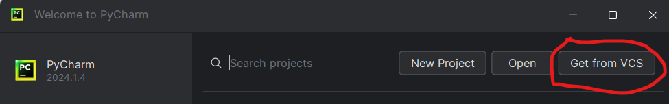
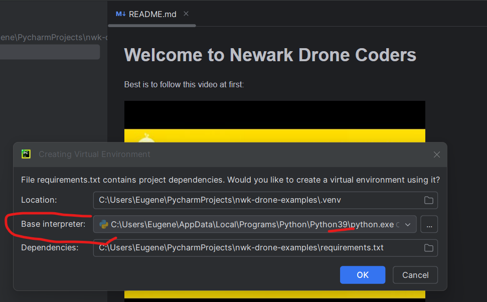
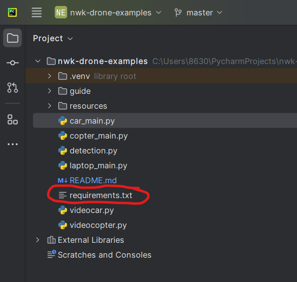
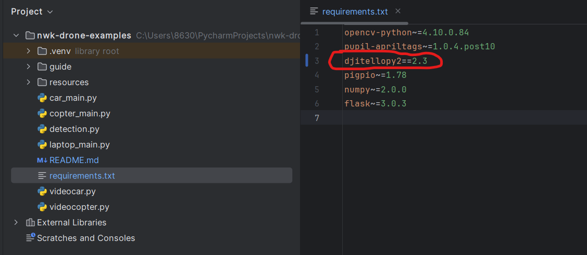
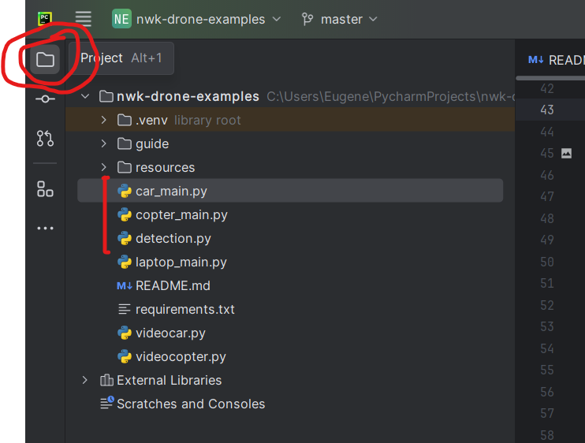

# Welcome to Newark Drone Coders
We are doing free-form meetups with no formal presentations, but simply exploring the steps below.

And everything seems to go well!

# Step one: learning to code
New to programming?

To get some basic training, we all played this awesome programming game, try it:
[Python CodeCombat](https://codecombat.com/students?_cc=ChairTypeCool)
.


Once you reached the middle of CodeCombat level Computer Science 3 ... you are absolutely ready to get your own Tello drone and proceed to coding it!

You can buy a Tello on eBay these days (you can buy used, but best is to get a "Tello Boost Combo" because it comes with extra batteries and some spare parts, both very important).


Of course, you are also welcome to continue to play CodeCombat into much more advanced levels, becoming a bigger programming expert along the way (not kidding, it is very good and can take you pretty far).

# Step two: so I have my Tello drone, now what?
Once you have your own Tello, best is to follow this video at first (lots of drone coding examples to try, step by step):

[](https://www.youtube.com/watch?v=LmEcyQnfpDA)

(huge thanks to Murtaza Hassan for taking his time to make the video).


# Step three: advanced things without strict manuals
Once you are done with the video above, it's time for an "expression session" -- using the more advanced examples below:
 * programming a quadcopter drone,
 * programming a four-wheel-drive car,
 * or even a (virtual) military intercept vehicle.

You can modify them in any way you wish, to fully express yourself and your creativity.

## Getting started with the advanced examples

Most professional python developers use PyCharm or VSCode, we'll be using PyCharm for now.

* First you need to download and install four things
  * Git: https://git-scm.com/downloads
  * Python 3.9: https://www.python.org/downloads/release/python-3913/
  * free PyCharm Community Edition (not Professional): https://www.jetbrains.com/pycharm/download/
  * And Microsoft Visual C++ Build Tools: https://aka.ms/vs/17/release/vs_BuildTools.exe


* When installing Microsoft BuildTools, simply pick C++:


* Start your PyCharm which you just installed and "clone" (download) this code onto your computer by doing this



you can simply use this URL: `https://github.com/epanov1602/nwk-drone-examples`


* And when the code download ("git clone") is completed, you will be offered to choose your Python version



^^ let's choose python 3.9 that you just downloaded and wait until various modules from requirements.txt download and install


* It something didn't go well, you can manually click on `requirements.txt`


and once the requirements file opens, right-click on any of the lines in it (for example, `djitellopy2`) and you'll be offered to install all the packages that are needed for this code to work -- you can agree and install




* After that installation is done, you should be in good shape to run this drone code!


## Running the examples

* If you click on the Project button in PyCharm, you can see which python code files ("modules") are already here




* Here `car_main.py`, `copter_main.py` and `laptop_main.py` are modules (code files) that you can run in order to
  * drive a car with camera
  * fly a copter with camera
  * just play with your laptop camera

* We will be changing them in order to accomplish different things

* Other modules contain various functions that are handy to have (for example, recognizing an AprilTag, or driving)


## Example 1D (flying a Tello drone with buttons)

In `copter_main.py` replace everything with this code:

```python
from djitellopy import Tello
import cv2

drone = Tello()
drone.connect()
drone.streamon()


while True:
    # if user pressed one of these buttons, do as said
    key = cv2.waitKey(1) & 0xFF
    if key == ord('l'):
        drone.land()  # L = land
    elif key == ord('t'):
        drone.takeoff()  # T = takeoff
    elif key == ord('w'):
        drone.move_forward(50)  # 50 centimeters
    elif key == ord('s'):
        drone.move_back(50)  # 50 centimeters

    # get a video frame and show it
    frame = drone.get_frame_read().frame
    if frame is None:
        continue  # try again, if nothing was read
    frame_width = frame.shape[1]
    cv2.imshow('drone video', frame)

```

## Example 1C (driving a 4 wheel drive car, with buttons)

In `car_main.py` replace everything with this code:

```python
import cv2
import videocar

videocar.start(simulation=False, motor_directions=(-1, -1), video_direction=-1)

while True:
    key = cv2.waitKey(1) & 0xFF
    if key == ord('a'):
        videocar.set_arcade_drive(forward_speed=0.3, right_turn_speed=-1)
    elif key == ord('d'):
        videocar.set_arcade_drive(forward_speed=0.3, right_turn_speed=1)
    elif key == ord(' '):
        videocar.set_arcade_drive(forward_speed=0, right_turn_speed=0)

    # get a video frame from car camera
    frame = videocar.get_video_frame()
    if frame is None:
        continue  # no frame

    # show it in car's web video feed
    videocar.display_web_video_frame(frame)
    
    # and show same frame in video window
    cv2.imshow("car", frame)
```

## Example 2D (chasing an AprilTag with drone)

In `copter_main.py` replace everything with this code:

```python
from djitellopy import Tello

import cv2
import pupil_apriltags as apriltags
#from ultralytics import YOLO
from time import time

import detection
import videocopter

# what kind of objects can we detect?
face_detector = cv2.CascadeClassifier('resources/haarcascade_frontalface_default.xml')
#model = YOLO("resources/yolov8s.pt")  # model to detect common objects like "person", "car", "cellphone" (see "COCO")
tag_detector = apriltags.Detector(families="tag36h11", quad_sigma=0.2)
tracker = detection.create_vit_tracker()

drone = Tello()
drone.connect()
drone.streamon()

# set desired speed to zero (at least before takeoff)
drone.send_rc_control(0, 0, 0, 0)  # command zero velocity


def follow_object():
    last_seen_x = None
    time_last_seen = 0

    while True:
        # 0. if user pressed one of these buttons, obey
        key = cv2.waitKey(1) & 0xFF
        if key == ord('l'):
            drone.land()  # L = land
        elif key == ord('t'):
            drone.takeoff()  # T = takeoff
        elif key == ord('w'):
            drone.move_forward(50)  # 50 centimeters
        elif key == ord('s'):
            drone.move_back(50)  # 50 centimeters

        # 1. read one video frame from the camera
        frame = drone.get_frame_read().frame
        if frame is None:
            continue  # try again, if nothing was read
        frame_width = frame.shape[1]

        # 2. locate the object
        x, y, w, h = None, None, None, None

        ## WARNING: it is better to uncomment the code below to use tracker (so you don't lost track of object)
        #if time_last_seen != 0:
        #    x, y, w, h = detection.update_tracker(tracker, frame, lowest_allowed_score=0.55)
        #    if x is not None:
        #        time_last_seen = time()  # if track is not lost, update the "last time seen"
        #    elif time() > time_last_seen + 1.0:
        #        time_last_seen = 0  # if track was lost for more than 1s, assume we can no longer track it

        # -- detect a new object, if never saw it (or lost it)
        if x is None:
            x, y, w, h = detection.detect_biggest_apriltag(tag_detector, frame)
            # x, y, w, h = detection.detect_biggest_face(face_detector, frame)
            # x, y, w, h = detection.detect_yolo_object(model, frame, valid_classnames={"cell phone"}, lowest_conf=0.3)

            if x is not None:  # if detected something, reset the tracker with this new object to track
                tracker.init(frame, (x, y, w, h))
                time_last_seen = time()

        # 3. make decisions
        status = "NEVER SAW"

        if x is not None:
            # if object is seen, set speed towards it
            last_seen_x = x
            status = "CHASING"
            if drone.is_flying:
                videocopter.drone_follow_object_pids(drone, frame, bbox=(x, y, w, h))
                if w >= 0.2 * frame_width and drone.is_flying:  # but if the object is very close, object is reached
                    status = "REACHED"

        elif last_seen_x is not None:
            # if not seen, try to slowly turn (ideally, in the direction where object was last seen)
            status = "SEEKING"
            seek_turn_speed = +50  # seek to the right by default
            if last_seen_x is not None and last_seen_x < frame_width / 2:
                seek_turn_speed = -50  # seek left if last saw it on the left
            if drone.is_flying:
                drone.send_rc_control(0, 0, 0, seek_turn_speed)

        # 4. print the status info on the video frame, and then show that frame
        status_text = f"bat: {drone.get_battery()}%, alt: {drone.get_distance_tof()}, width: {w}, " + status
        cv2.putText(frame, status_text, (5, 25), cv2.FONT_HERSHEY_PLAIN, 2, detection.GREEN, 2)

        # 5. and show that frame
        cv2.imshow('drone video', frame)

        # 6. finally, if status is "REACHED", land and break out of this loop
        if status == "REACHED":
            drone.send_rc_control(0, 0, 0, 0)  # command zero velocity
            cv2.waitKey(1)  # show the last frame of the video
            break


# the object following code is in this follow_object() function here, so we can call it many times
# (for example, if we first want to follow one object and then another)
follow_object()

# and after we return from follow_object() function, land the drone if it was flying
if drone.is_flying:
    drone.land()

```

* Try finding the "WARNING" in the code and uncommenting the tracker -- object tracking will become better

* Can you find a way to detect faces instead of AprilTag, using this code?
