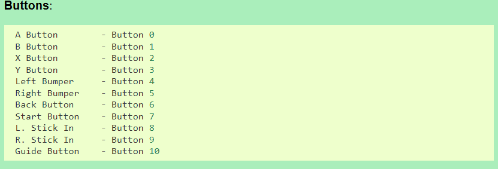

# Controlling a copter with joystick

Joystick has sticks, also known as "axes" (forward, right, etc.):
 * if the axis value is `0.0`, the stick is in the middle
 * if the axis value is `-0.99`, it is almost fully pushed back (-1.0 is the lowest)
 * if the axis value is `+0.99`, it is almost full pushed forward (+1.0 is the highest)

Joystick has buttons (X, Y, etc.):
 * if button has value `1`, it is pressed
 * if button has value `0`, it is not pressed.




## Example real flight program

```python
from djitellopy import Tello

import pygame
pygame.init()

# our joystick will be called "j0"
j0 = pygame.joystick.Joystick(0)

drone = Tello()
drone.connect()

kP_forward = 70.0

while True:
    joystick_input = pygame.event.get()
    if joystick_input:
        # first, see if there were buttons pressed (set == 1)
        button_a, button_b, button_y = j0.get_button(0), j0.get_button(1), j0.get_button(3)
        if button_y == 1:
            drone.takeoff()
        elif button_a == 1:
            drone.land()

        # second, if the drone is flying, we can take the axis input to control its speed
        if drone.is_flying:
            axis3 = j0.get_axis(3)  # axis can be: 0, 1, 2, 3
            
            forward_speed = int(axis3 * kP_forward)
            # ^^ "proportionally" (kP) convert axis value like 0.21 to speed like 15
            # (or axis value 0.42 to speed like 30)

            drone.send_rc_control(0, forward_speed, 0, 0)
```


## Example simulation program (so you can test new functionality without crashing)
```python
# simulated drone
drone_is_flying = False
drone_rc_control = (0, 0, 0, 0)

def drone_takeoff():
    global drone_is_flying
    if not drone_is_flying:
        drone_is_flying = True
        print("drone is flying")

def drone_land():
    global drone_is_flying
    if drone_is_flying:
        drone_is_flying = False
        print("drone has landed")

def drone_send_rc_control(leftright, fwd, updown, yaw):
    new_control = (leftright, forward_speed, updown, yaw)
    if new_control != drone_rc_control:
        print(f"drone rc: {leftright}(left), {fwd}(fwd), {updown}(up), {yaw}(yaw)")

# end of simulated drone


import pygame
pygame.init()

# our joystick will be called "j0"
j0 = pygame.joystick.Joystick(0)

# constants
kP_forward = 70.0

while True:
    joystick_input = pygame.event.get()
    if joystick_input:
        # first, see if there were buttons pressed (set == 1)
        button_a, button_b, button_y = j0.get_button(0), j0.get_button(1), j0.get_button(3)
        if button_y == 1:
            drone_takeoff()
        elif button_a == 1:
            drone_land()

        # second, if the drone is flying, we can take the axis input to control its speed
        if drone_is_flying:
            axis3 = j0.get_axis(3)  # axis can be: 0, 1, 2, 3

            forward_speed = int(axis3 * kP_forward)
            # ^^ "proportionally" (kP) convert axis value like 0.21 to speed like 15
            # (or axis value 0.42 to speed like 30)

            drone_send_rc_control(0, forward_speed, 0, 0)
```
